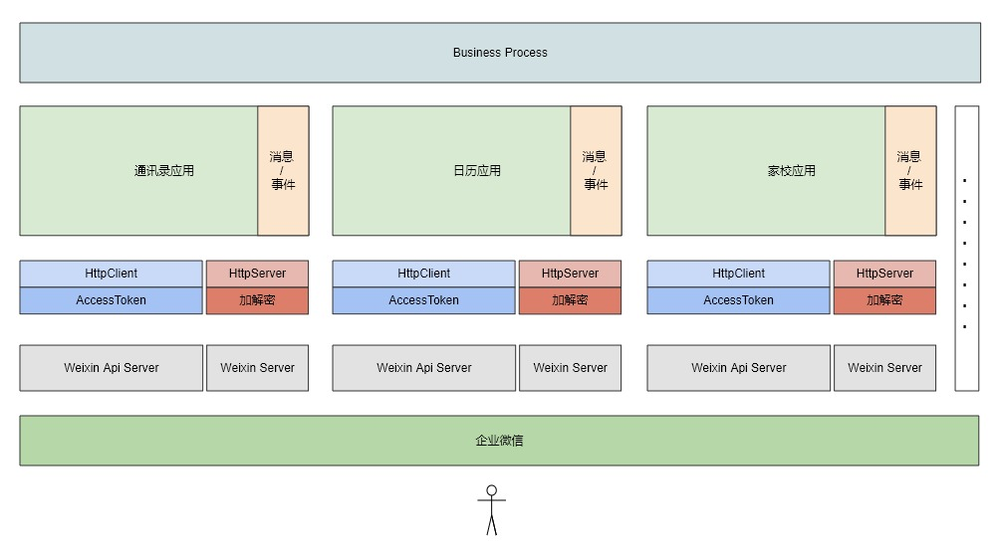

## 快速开始 & demo

```shell script
go get github.com/cvblood/qywxapi
```

```go

// 创建企业实例
Corp = corporation.New(corporation.Config{Corpid: "CROPID"})

//创建通讯录 App
ContactApp = Corp.NewApp(corporation.AppConfig{
    AgentId:        "AGENTID",
    Secret:         "SECRET",
    Token:          "TOKEN",
    EncodingAESKey: "EncodingAESKey",
})

// 通讯录管理 -> 获取部门成员详情
params := url.Values{}
params.Add("department_id", "10086")
resp, err := user.SimpleList(ContactApp, params)
```

接口列表：

[corporation/doc/apilist.md](corporation/doc/apilist.md)	

## 架构设计



### 符合直觉

作为第三方开发框架，尽可能贴合官方文档和设计，不引入新的概念，不给开发者添加学习负担

### 简洁而不过度封装

作为具体业务和企业微信之间的中间层，专注于通道的角色：帮业务把配置/材料投递到企业微信，将企业微信响应/推送透传回业务

至于 [AccessToken 管理](corporation/doc/access_token.md) 和 [消息加解密处理](corporation/doc/message.md)，框架内部完成得干净利落，开发者甚至觉察不到存在

### 官方文档就是最好的文档

每个接口的注释都附带官方文档的链接，让你随时翻阅，省时省心

### 详细的日志

每个关键环节都为你完整记录，Debug 倍轻松，你可以自由定义日志输出，甚至可以关闭日志

### 多账号支持

一套服务支持多个企业微信账号，轻松成为第三方开发服务平台，业务节节高

### 支持服务集群

单台服务器支撑不住访问流量/想提高服务可用性？

只需 [设置 GetAccessTokenFunc 方法] 从中控服务获取 AccessToken，即可解决多实例刷新冲突/覆盖的问题
